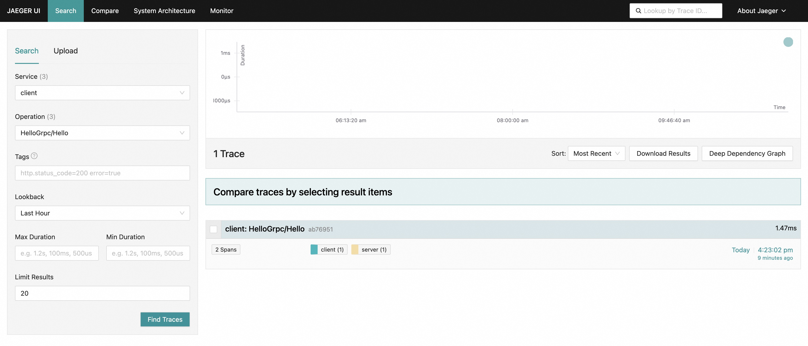

# OpenTelemetry Go Auto Instrumentation

## Introduction

This project provides an automatic solution for Go applications that want to leverage OpenTelemetry to enable effective
observability.

## Quick Demo

1. Launch jaeger

   ```shell
   $ docker run --rm --name jaeger \
     -e COLLECTOR_ZIPKIN_HOST_PORT=:9411 \
     -p 6831:6831/udp \
     -p 6832:6832/udp \
     -p 5778:5778 \
     -p 16686:16686 \
     -p 4317:4317 \
     -p 4318:4318 \
     -p 14250:14250 \
     -p 14268:14268 \
     -p 14269:14269 \
     -p 9411:9411 \
     jaegertracing/all-in-one:1.53
   ```

2. Launch demo

   ```shell
   # 1. build the project
   $ go build -a

   # 2. build & run the demo server
   $ cd example/server
   $ ../../otel-auto-instrumentation
   $ OTEL_EXPORTER_ENDPOINT="localhost:4318" OTEL_EXPORTER_INSECURE=true OTEL_SERVICE_NAME=server ./server

   # 3. build & run the demo client in a new shell
   $ cd example/client
   $ ../../otel-auto-instrumentation
   $ OTEL_EXPORTER_ENDPOINT="localhost:4318" OTEL_EXPORTER_INSECURE=true OTEL_SERVICE_NAME=client ./client
   ```

Then we can see trace data at http://localhost:16686/search.



## Packages

|   Instrumentation Package   | Metrics | Traces |
|:---------------------------:|:-------:|:------:|
|          net/http           |         |   ✓    |
|  github.com/gin-gonic/gin   |         |   ✓    |
|   google.golang.org/grpc    |         |   ✓    |
|   github.com/gorilla/mux    |         |   ✓    |
| github.com/labstack/echo/v4 |         |   ✓    |

## Implementation

The current implementation
reuses [the existing instrumentation for Go packages](https://github.com/open-telemetry/opentelemetry-go-contrib/tree/main/instrumentation)
and depends on the package `dave/dst` to rewrite Go source code.

The main process is as follows (see driver.go):

- Use `go build -a -x -n` to retrieve packages that the application depends on

- Inject snippets into `package main` based on the result of step 1
    - Setup hooks for frameworks/libraries
    - Setup OTel SDK

- Build the application and rewrite code using `-toolexec`
    - Inject snippets that define hooks into the target packages
    - Rewrite source code to invoke hooks

## Next Steps

- More popular packages support
- Different versions of a library may require distinct instrumentation approaches
- Instrument user code and Go Runtime
