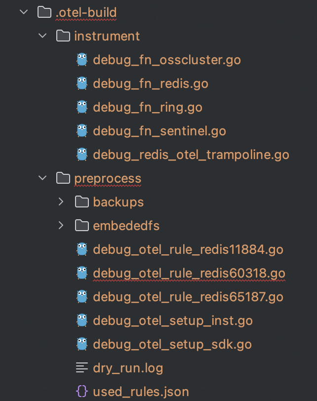

## How to debug

`opentelemetry-go-auto-instrumentation` provides some convenient ways for users to debug the instrumented program.

## 1. Do the instrumentation with -debug options

```bash
# go build
$ ./otel-go-auto-instrumentation -debug
```

After alerting the `-debug` option, `otel-go-auto-instrumentation` will build an unoptimized binary file with more
debugging information.

## 2. Check `.otel-build` directory

After doing the instrumentation, users can check the debugging files in `instrument` directory and `preprocess`
directory. The debugging files
in `preprocess` directory show all the rule files that are matched, and the debugging files in `instrument` directory
show the instrumented plugin code.


## 3. Use delve to debug binary

No optimization will be taken with the `-debug` option during the hybrid compilation. Users can
use [delve](https://github.com/go-delve/delve) to debug the binary file easily.