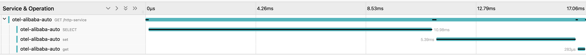
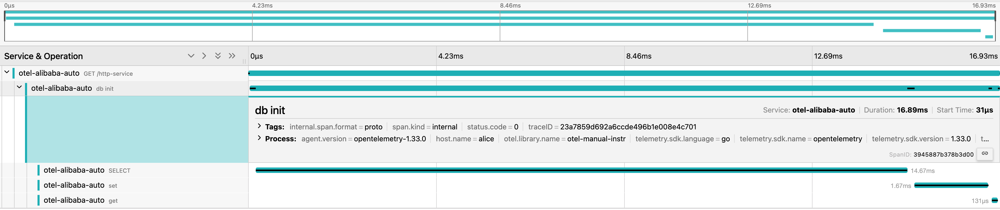

## 与手动插桩集成

自动插桩在大多数场景下已经能够满足我们的需求，但手动插桩允许开发人员对他们的项目有更大的控制权。

### 自动插桩

基于 `example/demo`，自动插桩生成一个跟踪，其中 HTTP 服务作为根 span，Redis 和 MySQL 操作作为子 span。



### 与手动插桩结合

手动插桩使我们能够捕获特定的遥测数据。在 `example/demo/pkg/http.go` 中，我们可以向 `traceService()` 函数添加一个手动 span，该函数封装了数据库操作。
```go
var tracer = otel.Tracer("otel-manual-instr")

func traceService(w http.ResponseWriter, r *http.Request) {
	_, span := tracer.Start(r.Context(), "db init")
	defer span.End()
    
    ...
}
```

生成的 Jaeger 跟踪如下所示。


