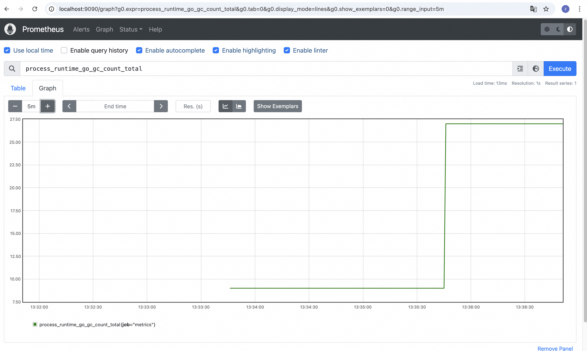

## Use opentelemetry-go-auto-instrumentation to report metrics

The example shows how to use opentelemetry-go-auto-instrumentation to report metrics.

## Do hybrid compilation with otel

Do hybrid compilation with otel according to [README.md](../demo/README.md).

## Start OpenTelemetry Collector and Prometheus server

You can use `docker-compose` to run the OpenTelemetry Collector and Prometheus server locally.

```shell
docker compose up --force-recreate --remove-orphans --detach
```

If you have a Kubernetes cluster, you can deploy the OpenTelemetry Collector and Prometheus server in Kubernetes
according to [OpenTelemetry Kubernetes Deployment](https://opentelemetry.io/docs/demo/kubernetes-deployment/).

```shell
kubectl apply -f metrics.yaml
```

## Run Application

Set the endpoint and other otel-related environment variables according to
the [document](https://opentelemetry.io/docs/specs/otel/configuration/sdk-environment-variables/) and execute the
binary.

```shell
OTEL_EXPORTER_OTLP_ENDPOINT="http://127.0.0.1:4318" OTEL_EXPORTER_OTLP_INSECURE=true OTEL_SERVICE_NAME=metrics ./metrics
```

And you can request to the server to generate some metrics:

```shell
# For Golang GC metrics
curl localhost:9000/gc-metrics
# For Golang Memory metrics
curl localhost:9000/mem-metrics
```

## Query Metrics

Open the Prometheus UI at http://localhost:9090 to query metrics:



## Related

OpenTelemetry also supports to report metrics data to Prometheus directly. You can refer to
the [document](https://opentelemetry.io/docs/specs/otel/configuration/sdk-environment-variables/)
to set the Prometheus endpoint.