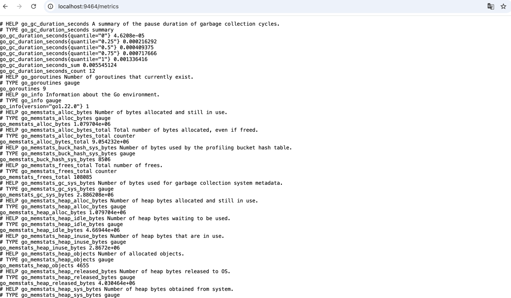

## Use opentelemetry-go-auto-instrumentation to report metrics

The example shows how to use opentelemetry-go-auto-instrumentation to report metrics in prometheus format.

## Do hybrid compilation with otel

Do hybrid compilation with otel according to [README.md](../../demo/README.md).

## Start OpenTelemetry Collector and Prometheus server

You can use `docker-compose` to run the Prometheus server locally.

```shell
docker compose up --force-recreate --remove-orphans --detach
```

## Run Application

Set the endpoint and other otel-related environment variables according to
the [document](https://opentelemetry.io/docs/specs/otel/configuration/sdk-environment-variables/) and execute the
binary.

```shell
OTEL_METRICS_EXPORTER=prometheus OTEL_EXPORTER_PROMETHEUS_PORT=9464 ./metrics
```

And you can request to the server to generate some metrics:

```shell
# For Golang GC metrics
curl localhost:9000/gc-metrics
# For Golang Memory metrics
curl localhost:9000/mem-metrics
```

## Query Metrics

Open the http://localhost:9464/metrics to query metrics in local server:



Open the Prometheus UI at http://localhost:9090 to query metrics in prometheus server:


